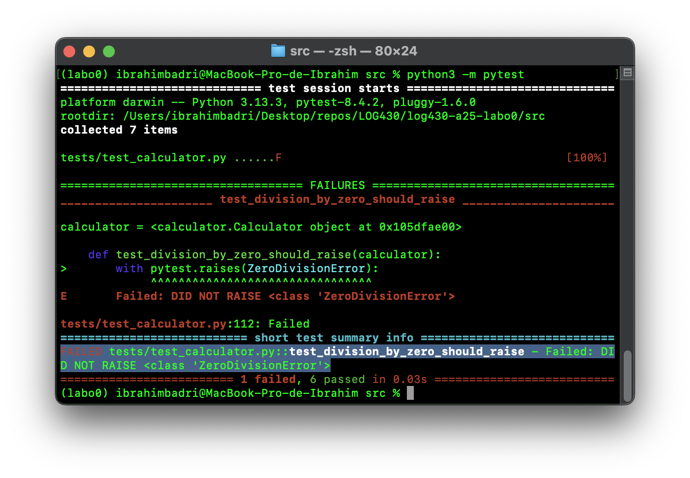
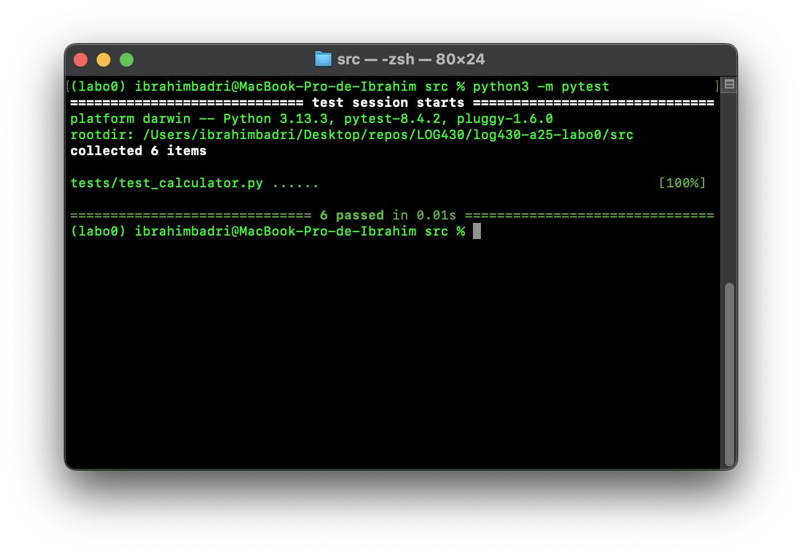
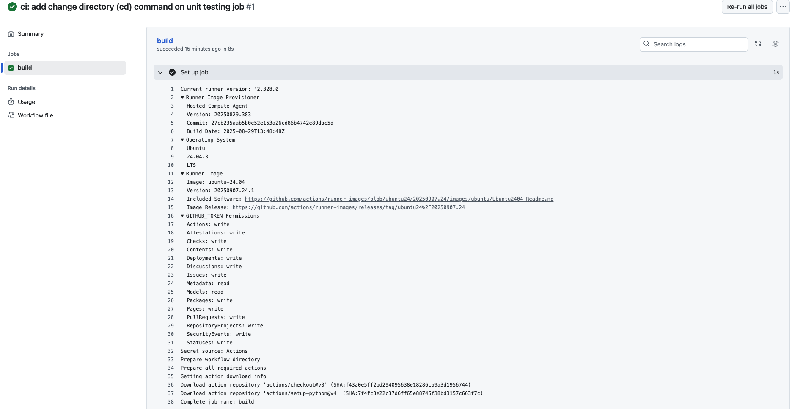
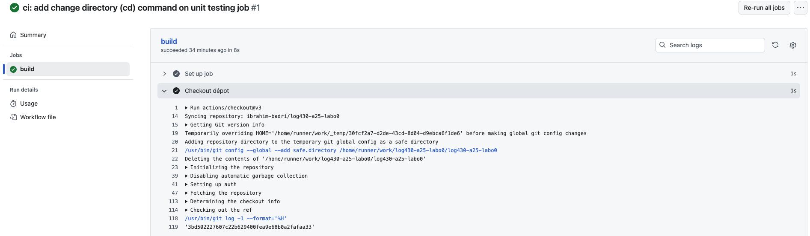
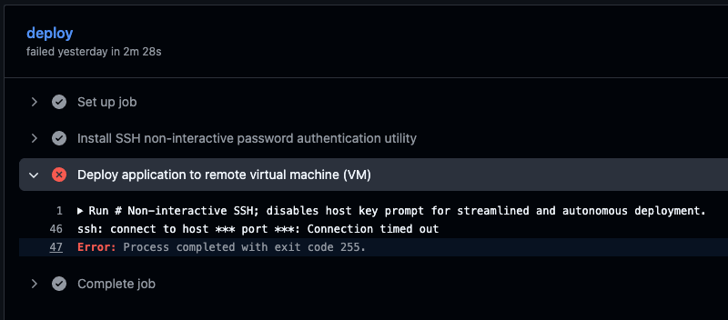
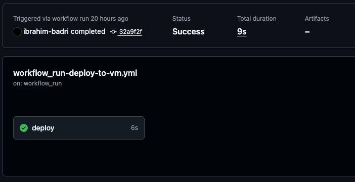
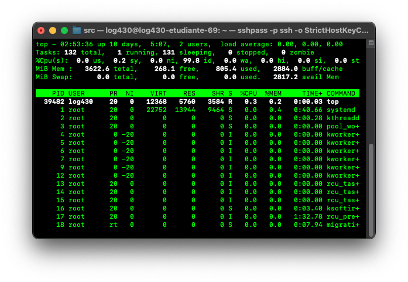

<div align="center">

<h1 style="font-size:18pt;">
Laboratoire 0 : Infrastructure (Git, Docker, CI/CD)
</h1>

<br>

<h2 style="font-size:16pt;">
PAR
</h2>

<br>

<h2 style="font-size:16pt;">
Ibrahim BADRI, BADI02089900
</h2>

<br><br>

<h3 style="font-size:14pt;">
RAPPORT DE LABORATOIRE PRÉSENTÉ À MONSIEUR FABIO PETRILLO DANS LE CADRE DU COURS <em>ARCHITECTURE LOGICIELLE</em> (LOG430-02)
</h3>

<br><br>

<h3 style="font-size:14pt;">
MONTRÉAL, LE 13 SEPTEMBRE 2025
</h3>

<br>

<h3 style="font-size:14pt;">
ÉCOLE DE TECHNOLOGIE SUPÉRIEURE<br>
UNIVERSITÉ DU QUÉBEC
</h3>

</div>

---

### Tables des matières 
- [Question 1](#question-1)
- [Question 2](#question-2)
- [Question 3](#question-3)
- [Question 4](#question-4)

---

<div style="text-align: justify;">

#### Question 1

> Si l’un des tests échoue à cause d’un _bug_, comment `pytest` signale-t-il l’erreur et aide-t-il à la localiser ? Rédigez un test qui provoque volontairement une erreur, puis montrez la sortie du terminal obtenue.

</div>

<div style="text-align: justify;">

Lorsque l’un des tests échoue à cause d’un _bug_, `pytest` l’indique clairement dans le terminal en affichant le nombre total de tests exécutés, réussis et échoués, puis détaille dans la section `FAILURES` le nom de la fonction de test fautive, le fichier et la ligne exacte où l’erreur s’est produite ainsi que le message explicatif qui s’y applique. Dans le cadre de l’exécution de mon test volontairement faux, on obtient le message `DID NOT RAISE <class ‘ZeroDivisionError’>` qui découle d’une division d’un chiffre par zéro $(0)$. L’échec provient du fait que le code testé renvoie simplement une chaîne de caractères au lieu de lever l’exception attendue, ce qui provoque le décalage entre le contrat du test et le comportement réel de la fonction.

<p style="text-align: center;">
  
  <br>
  <em>Figure 1. Résultat de l'exécution d'un test comportant une erreur</em>
</p>

<br>

L’ensemble des tests unitaires couvre les opérations fondamentales de la calculatrice ainsi que l’ensemble des cas limites connus.
Les fonctions de test sont disponibles dans le fichier [`test_calculator.py`](../../src/tests/test_calculator.py
). Suite au retrait du test fautif, le succès du test unitaire est également affiché dans le terminal de la façon suivante :

<p style="text-align: center;">
  
  <br>
  <em>Figure 2. Résultat de l'exécution des tests exempts d'erreurs</em>
</p>

##### Question 2

> Que fait GitLab (GitHub) pendant les étapes de « _Setup repository_ » et « _Checkout repository_ » ? Veuillez inclure la sortie du terminal Gitlab CI (GitHub Actions) dans votre réponse.

À l’issue des étapes définies dans le fichier de configuration d'intégration continue (CI), nous obtenons dans un premier temps cette sortie qui correspond à la phase d’initialisation _Set up job_ d’un GitHub Actions démarrant d’abord un _runner_ éphémère, à l’échéance une machine virtuelle `Ubuntu 24.04 LTS` en prenant le soin de préciser la version du logiciel et l’image utilisée avec tous les outils préinstallés. Il génère ensuite le `GITHUB_TOKEN` et affiche les permissions associées pour permettre aux étapes du _workflow_ d’interagir en toute sécurité avec le dépôt GitHub. Le système crée ensuite le répertoire de travail temporaire puis télécharge les actions mentionnées dans le fichier de _workflow_ en vérifiant leur intégrité grâce à leurs SHA spécifiques. Une fois ces préparatifs terminés, le job nommé `build` peut démarrer et exécuter les étapes de compilation, de tests ou de déploiement définies.

<br>

<p style="text-align: center;">
  
  <br>
  <em>Figure 3. Résultat de sortie de la première étape du build</em>
</p>

<br>

Dans un second temps, nous obtenons une sortie qui correspond à la deuxième étape intitulée _Checkout_ dépôt (_repository_) et qui procède à l’exécution de l’action `actions/checkout@v3`, qui prépare le _runner_ GitHub Actions puis `clone` le dépôt actuel pour le rendre disponible au reste du _workflow_. Par la suite, il procède à l’ajout du répertoire de travail comme _safe directory_, à la suppression de tout le contenu résiduel, à l’initialisation d’un dépôt Git local, à la configuration de l’authentification avec le `GITHUB_TOKEN`, à la récupération du code via un `git fetch` limité au dernier commit et positionne la branche locale sur la révision exacte `3bd502227607c22b629400fea9e68b0a2fafaa33` de manière que le code source complet de ce _commit_ soit prêt pour les étapes suivantes.

<br>

<p style="text-align: center;">
  
  <br>
  <em>Figure 4. Résultat de sortie de la deuxième étape du build</em>
</p>

##### Question 3

> Quel approche et quelles commandes avez-vous exécutées pour automatiser le déploiement continu de l'application dans la machine virtuelle ? Veuillez inclure les sorties du terminal et les scripts Bash dans votre réponse.

Pour mettre en place le déploiement continu (CD) de mon application dans la machine virtuelle, j’ai d’abord élaboré un _pipeline_ d’intégration continue (CI) dans GitHub Actions déclenché à chaque `push` ou `pull request` afin d’exécuter automatiquement toutes les étapes de validation du code. Ce _workflow_, défini dans le fichier `.github/workflows/push_pr-build-tests.yml`, télécharge le dépôt avec `actions/checkout@v3`, installe l’environnement Python 3.11 grâce à `actions/setup-python@v4`, met à jour l’outil `pip`, installe l’ensemble des dépendances à partir du fichier `requirements.txt` et installe explicitement `pytest` pour l’exécution des tests. La dernière étape change de répertoire vers `src` puis lance la commande `python3 -m pytest` pour exécuter tous les tests unitaires. Il est d'ailleurs important de noter que l’échec d’un seul test interrompt le _pipeline_ et empêche toute suite du processus. Ci-dessous se trouve le contenu intégral du fichier de configuration _Yet Another Markup Language_ (YAML) de l'intégration continue.

<br>

```yaml
name: CI

on: [push, pull_request]

jobs:
  build:
    runs-on: ubuntu-latest

    steps:
      - name: Repository checkout
        uses: actions/checkout@v3

      - name: Install Python
        uses: actions/setup-python@v4
        with:
          python-version: '3.11'

      - name: Install dependencies
        run: |
          python -m pip install --upgrade pip
          pip install -r requirements.txt
          pip install pytest

      - name: Launch unit tests
        run: |
          cd src
          python3 -m pytest
```
<br>

Une fois cette intégration continue validée, j’ai configuré un deuxième workflow de déploiement continu (CD), défini dans `.github/workflows/workflow_run-deploy-to-vm.yml`, déclenché uniquement après la réussite complète du job CI via l’événement `workflow_run`. Ma première approche consistait à utiliser un _runner_ GitHub hébergé dans l'espace infonuagique et une connexion SSH non-interactive vers la machine virtuelle provisionné à l’aide de l’utilitaire `sshpass`. Ce _job_ installait d’abord `sshpass` puis ouvrait une session SSH par le biais de la commande  `ssh -o StrictHostKeyChecking=no` en lisant l’utilisateur, le mot de passe, le port et l’hôte depuis les GitHub Secrets `USERNAME`, `SSH_PASSWORD`, `SSH_PORT` et `HOST` avant d’exécuter à distance une série de commandes tel que le clonage du dépôt si nécessaire, la mise à jour de la branche main avec `git fetch --all --prune`, `git checkout main` et `git pull --ff-only`, la construction et le lancement des conteneurs via `docker-compose build --no-cache` et `docker-compose up -d --remove-orphans`, le nettoyage des images avec `docker image prune -f` et l'affichage de l’état final des services grâce à `docker-compose ps`. Ci-dessous se trouve l'intégralité di fichier de configuration.

<br>

```yaml
name: CD

on:
  workflow_run:
    workflows: ["CI"]
    types:
      - completed

jobs:
  deploy:
    if: ${{ github.event.workflow_run.conclusion == 'success' }}
    runs-on: ubuntu-latest

    steps:
      - name: Install SSH non-interactive password authentication utility
        run: sudo apt-get update && sudo apt-get install -y sshpass

      - name: Deploy application to remote virtual machine (VM)
        shell: bash
        env:
          SSH_PASSWORD: ${{ secrets.SSH_PASSWORD }}
          USERNAME: ${{ secrets.USERNAME }}
          HOST: ${{ secrets.HOST }}
          SSH_PORT: ${{ secrets.SSH_PORT }}
          GITHUB_REPOSITORY: ${{ github.repository }}
        run: |
          sshpass -p "$SSH_PASSWORD" ssh -o StrictHostKeyChecking=no -p "$SSH_PORT" \
            "$USERNAME@$HOST" "
              set -euo pipefail
              REPOSITORY_NAME=\$(basename \"$GITHUB_REPOSITORY\")
              cd ~
              if [ ! -d \"\$REPOSITORY_NAME\" ]; then
                git clone https://github.com/$GITHUB_REPOSITORY.git \"\$REPOSITORY_NAME\"
              fi
              cd \"\$REPOSITORY_NAME\"
              git fetch --all --prune
              git checkout main
              git pull --ff-only
              docker-compose build --no-cache
              docker-compose up -d --remove-orphans
              docker image prune -f
              docker-compose ps
            "
```
<br>

 Cependant, cette méthode a échoué en raison de l’impossibilité d’établir une connexion SSH entrante vers la machine virtuelle celle-ci étant hébergée sur le réseau privé de l’école et donc injoignable depuis Internet. Par conséquent, on constate l'échec déploiement continu via cette approche. 

 <br>

 <p style="text-align: center;">
  
  <br>
  <em>Figure 5. Échec du déploiement continu via connexion SSH</em>
</p>

 <br>
 
 Pour contourner cette limitation, j’ai déployé un _runner_ auto-hébergé dit _self-hosted_ directement sur la machine virtuelle en suivant les instructions exhaustives énumérées sur GitHub. Ce second _workflow_ conserve le même déclencheur `workflow_run` mais s’exécute sur l’étiquette `runs-on: [self-hosted, Linux, X64]`, ce qui lui permet d’exécuter les commandes de déploiement localement sans passer par SSH. Concrètement, le _job_ commence par activer l’option `set -euo pipefail` pour que tout échec stoppe immédiatement le processus, puis détermine le nom du dépôt avec `REPOSITORY_NAME=$(basename "$GITHUB_REPOSITORY")`. Il se place dans le répertoire personnel, clone le dépôt s’il n’existe pas déjà, exécute `git fetch --all --prune`, `git checkout main` et `git pull --ff-only` afin d’obtenir la dernière révision de la branche principale, puis reconstruit l’image avec `docker compose build --no-cache` et relance les conteneurs en mode détaché avec `docker compose up -d --remove-orphans`. Enfin, il libère l’espace disque inutile via `docker image prune -f` et affiche l’état actuel des services grâce à `docker compose ps`. Ci-dessous se trouve l'intégralité du fichier de configuration.
 
  <br>

```yaml
  name: CD

on:
  workflow_run:
    workflows: ["CI"]
    types:
      - completed

jobs:
  deploy:
    if: ${{ github.event.workflow_run.conclusion == 'success' }}
    runs-on: [self-hosted, Linux, X64]

    steps:
      - name: Deploy application to remote virtual machine (VM)
        shell: bash
        env:
          GITHUB_REPOSITORY: ${{ github.repository }}
        run: |
          set -euo pipefail
          REPOSITORY_NAME=$(basename "$GITHUB_REPOSITORY")
          cd ~
          if [ ! -d "$REPOSITORY_NAME" ]; then
            git clone https://github.com/$GITHUB_REPOSITORY.git "$REPOSITORY_NAME"
          fi
          cd "$REPOSITORY_NAME"
          git fetch --all --prune
          git checkout main
          git pull --ff-only
          docker compose build --no-cache
          docker compose up -d --remove-orphans
          docker image prune -f
          docker compose ps
 ```
 
   <br>
 
 Grâce à cette configuration, chaque `push` validé par les tests unitaires entraîne automatiquement la mise à jour du code et le redémarrage propre des conteneurs sur la machine virtuelle. Il s'avère que cette approche à permis le succès du déploiement continu.

<br>

 <p style="text-align: center;">
  
  <br>
  <em>Figure 6. Succès du déploiement continu via auto-hébergement</em>
</p>

<br>

Pour favoriser la simplicité, la rigueur et la modularité du déploiement, il aurait été judicieux d’extraire certaines parties des commandes directement présentes dans les _jobs_ du _workflow_ et de les regrouper dans un ou plusieurs scripts Bash dédiés, appelés ensuite par ces _jobs_.

##### Question 4

>  Quel type d'informations pouvez-vous obtenir via la commande `top` ? Veuillez inclure la sortie du terminal dans votre réponse.

La commande `top` est un outil de surveillance en temps réel qui permet d’évaluer rapidement l’activité d’un système Linux. Son exécution affiche un tableau qui se met à jour régulièrement et fournit, d’un côté, des informations globales sur la machine telles que la charge moyenne du processeur sur une, cinq et quinze minutes, la durée de fonctionnement depuis le dernier démarrage, l'utilisation du _central processing unit_ (CPU) et de la mémoire D'autre part, elle affiche également la liste des processus en cours. Pour chaque processus, `top` indique notamment l’identifiant (PID), l’utilisateur, la priorité, le pourcentage de CPU et de mémoire utilisés, le temps total d’exécution et la commande qui l’a lancé.


<p style="text-align: center;">
  
  <br>
  <em>Figure 7. Résultat de sortie de la commande top</em>
</p>

</div>


